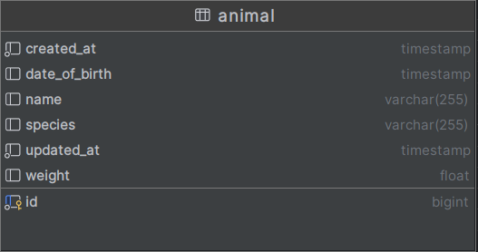
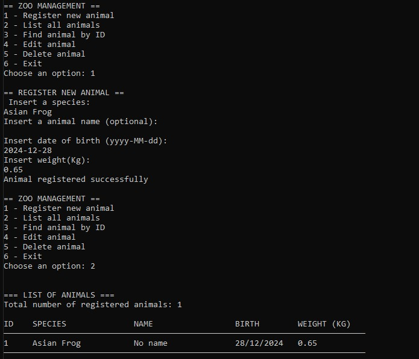
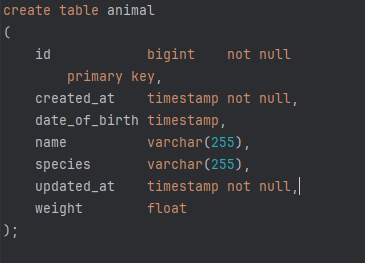

# Zoo Project
___

## Tech Stack
- Java 17
- Spring Boot 3.5.5
- Maven
- SQLite

## Overview

This project is a console application developed in Java. The objective is to demonstrate practical skills in creating an application with CRUD (Create, Read, Update, Delete) functionalities using an SQLite database.

The chosen resource for management is the **Animal**, representing animals in a zoo. Each animal has a unique ID and a set of properties, including mandatory fields, optional fields, and varied data types (text, number, and date).

The table below illustrates the database schema used in this project:



</br>

## Getting Started

### Setup

1. Clone the repository:
   ```sh
   git clone https://github.com/ruggieroromulo/ZooProject.git
   cd ZooProject
   ```
   
2. Build the project:
   The project uses Maven to manage dependencies and the build process. The SQLite database will be created automatically on the first run.
   ```sh
    mvn clean package -DskipTests
    ```

    ```sh
    docker build -t zoo-project .
    ```

   

### Running the Application
To run the console application, use the following command in the project's root directory. This will execute the packaged JAR file generated by Maven.

```sh
  docker run -it --rm zoo-project
```

</br>
## Using the Application

When you start the application, an interactive menu will be displayed in the console, allowing you to perform CRUD operations.

**Menu Options:**
1.  **List all animals:** Displays a list of all animals stored in the database.
2.  **Find animal by ID:** Prompts for an ID and displays the details of the corresponding animal, if found.
3.  **Register new animal:** Starts a form to add a new animal, prompting for each property and validating the inputs.
4.  **Update animal:** Prompts for the ID of an existing animal to update its information.
5.  **Delete animal:** Prompts for the ID of an animal to remove it from the database.
6.  **Exit:** Closes the application.

**Example Interaction:**



</br>
## Database

This project uses **SQLite**, a lightweight, embedded database that stores data in a local file (`zoo.db`), created in the project's root directory.

The SQL script for creating the `animal` table is located in `database/schema.sql` and is executed automatically by the application on its first startup if the database does not exist.



</br>
## Input Validation
To ensure data integrity and consistency, the application implements a robust validation system during the animal registration and update processes. The user is always guided with clear messages and prompted to correct the data until the input is valid.

The following validation rules have been implemented:

*   **Required Fields:** All fields marked as required (`species` and `date_of_brith` and `weight`) are checked to ensure they are not left blank. If a user attempts to submit an empty value, they will be notified and prompted to enter the data again.

*   **Weight Validation (`wieght`):** The `weight` (weight) field, when provided, must be a positive and realistic numeric value. The application validates that the value is within the range **greater than 0** and **less than or equal to 6000** kg.

*   **Date Validation (`date_of_birth`):** The date of birth undergoes multiple checks to ensure its correctness:
    *   **Valid Format:** The date must be entered strictly in the `YYYY-MM-DD` format.
    *   **No Future Dates:** The application verifies that the entered date is not later than the current date.
    *   **Calendar Validity:** The system validates that the month (1-12) and day values are realistic (e.g., it does not allow February 30th in leap years or January 32nd).

These validations ensure that only coherent and complete data is persisted to the database.

</br>
## Additional Features

This section describes a aditional features that have been or could be implemented in the project.

### Unit Tests
To ensure code quality and robustness, unit tests were implemented using JUnit 5 and Mockito. To run the tests, use the following command:
```sh
  mvn test
```

### Containerization (Docker)
To facilitate distribution and execution in different environments, the application can be containerized with Docker, following the steps mentioned above.
This will start the container and open the console application's menu directly in your terminal.

### Logging and Auditing
To improve data tracking, debugging, and auditing, a logging system has been implemented on two fronts:

*   **Database Auditing:** Two timestamp fields have been added to the `animal` table to automatically record when each record was created and last modified.
    *   `created_at`: Stores the exact date and time a new animal is inserted into the database. This value does not change after creation.
    *   `updated_at`: Stores the date and time of the record's last update. It is initialized with the same value as `created_at` and is updated with every `UPDATE` operation.
    *   

*   **Console Feedback:** In addition to database auditing, the application provides verbose feedback in the console to guide the user during interaction. The console outputs include:
    *   Confirmation messages for every successful operation (creation, update, deletion).
    *   Clear instructions on what data to input.
    *   Detailed and user-friendly error messages, such as "ID not found" or "Required field cannot be empty," which help the user understand and correct issues.
